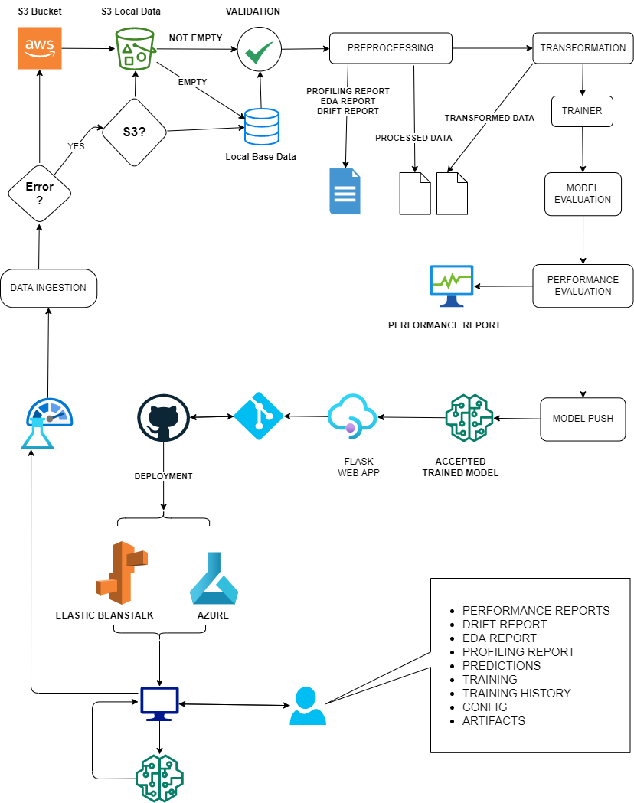

# <h1 style="color: red; text-align:center; font-weight: bold">Thyoid Disease Classification: A Multiclass Classfication Approach</h1>

## **Background:**

Thyroid disease is a common cause of medical diagnosis and prediction, with an onset that is difficult to forecast in medical research. The thyroid gland is one of our body's most vital organs. Thyroid hormone releases are responsible for metabolic regulation. Hyperthyroidism and hypothyroidism are one of the two common diseases of the thyroid that releases thyroid hormones in regulating the rate of body's metabolism.

### **Explanation of Thyroid Detection Terms**

### Negative
Indicates the absence of any thyroid disease.

### Binding Protein Related
- **Increased Binding Protein:** High levels of thyroid-binding globulin (TBG) in blood.
- **Decreased Binding Protein:** Low levels of TBG in blood.

### Hypothyroidism
- **Compensated Hypothyroidism:** TSH levels are high but thyroid hormone levels are within normal range.
- **Primary Hypothyroidism:** Caused by a dysfunction of the thyroid gland itself.
- **Secondary Hypothyroidism:** Caused by a malfunction in the pituitary gland or hypothalamus.

### Hyperthyroidism
- **Hyperthyroidism:** Overactive thyroid gland.
- **T Toxic:** Presence of antibodies that stimulate the thyroid gland to produce too much thyroid hormone.

### Goitre
Enlargement of the thyroid gland.

### Replacement Therapy
- **Replacement Therapy:** Refers to the treatment of hypothyroidism with thyroid hormone replacement drugs.
- **Underreplacement:** Insufficient thyroid hormone replacement.
- **Overreplacement:** Excessive thyroid hormone replacement.

### Sick
Thyroid function is affected by an underlying medical condition.

### Discordant
Results of thyroid tests are inconsistent or do not match clinical symptoms.

## **Problem Statement**
Multiclass Classification of Diseased state of thyroid.

## **Dataset:**

<a href="https://archive.ics.uci.edu/ml/datasets/thyroid+disease"><button data-md-button>Dataset</button></a>

## **Deployment**

<a href="/"><button data-md-button>Deployment</button></a> 

# **Data Structure**

-   Independent features in original dataset: `30`
-   Categorical features: `23`
-   Continuous Independent features: `7`
-   Number of class labels in origianl dataset: `15`
-   Grouped class labels: `08`
-   Features selected based on domain knowledge and SelectKBest method with chi2 test : `20`
-   Total Size of original raw data: `(22632, 30)`
-   Total size of dataset after processing and transformation: `(4741, 20)`
-   Train size: `(3792, 20)`
-   Test size: `(949, 20)`

| Grouped Category | Target Variables |
| ---------------- | ---------------- |
| Negative         | negative         |
| Binding Protein  | increased binding protein decreased binding protein |
| Hypothyroidism   | compensated hypothyroid primary hypothyroid secondary hypothyroid |
| Hyperthyroidism  | hyperthyroid T toxic secondary toxic |
| Goitre           | goitre           |
| Replacement      | replacement therapy underreplacement overreplacement |
| Sick             | sick             |
| Discordant       | discordant       |

# **Architechture**

# **Coding Methodology**

## **Tools & Techniques**

*   `Data versioning` using time stamp
*   `Code versioning` using Git
*   `Modular coding` with separate files for data ingestion, transformation, validation, training, evaluation, performance monitoring, model pusher, model configuration, constants, secret keys, artifacts etc
*   `CI / CD Pipeline` using GitHub Actions
*   `S3 Bucket` for storage of dataset.
*   `Docker` for creating container
*   Custome `logger`
*   Custom `Exception Handler`
*   `Package building` using setuptools
*   `Deplyment` on **Auzre**, **Render**

## **Data Ingestion**

*   Implemented `S3 Bucket` for cloud storage of data
*   Base data will be available locally
*   Once the model training is triggered, app wil first try to connect with `S3 bucket`:
    * if successfull, it will make local repository for the data fetched with proper data versioning.
    * if failed, it will check:
        * if previously fetch `S3 bucket` data is locally available or not.
            *   If available, then it will use latest version of data available in local s3 bucket folder.
            *   If not available, it will use base data which be available without any modification.

##   **Data Validation**
*   Data will be validated for availability of independent and dependent features.

##   **Data Processing and Transformation**

*   Data type handling
*   Missing value handdling with **SimpleImputer**
*   Target variable processing  **LabelEncoder**
*   Outlirs handling using **IQR** method and replaced outlier with upper and lower fence
*   Grouping 15 class labels into 8 major class labels based on domain knowledge

## **Model Training & Evaluation**

*   `RandomForestClassifier` is best performer. Apart from it `KNeighborClassifer`, `LightGBM`, `AdaBoost` has also been tested.
*   Model will be trained based on the parameter grid defined in model.yaml file
*   Trained model will be evaluated based on different metrices:

    *   **F1 Weighted Score**
    *   **ROC AUC Ovr Weighted**
    *   **Balanced Accuracy**
    *   **Log Loss**

*   For the model to be accepted it needs to be above the defined thresholds:

    *   **Balanced Accuracy train >= 0.87**
    *   **Balanced Accuracy train tst diff <= 0.06**
    *   **F1 Weighted train >= 0.70**
    *   **F1 Weighted train test diff <= 0.04**    
    *   **ROC AUC Ovr Weighted train >= 0.88**
    *   **ROC AUC Ovr Weighted train test diff <= 0.05**
    *   **Log Loss train <= 1.013**
    *   **Log Loss train test diff <= 0.05**

## **Model Pushing**

* The accepted model will be saved separately and will automatically integrated with **FlaskWeb App**

## **Logger and Exception Handler**

Custom logger and exception handler have been implemented at required places

## **Reports**

All reports will be automatically generated during the proces

*   **DRIFT REPORT**
*   **PROFILING REPORT**
*   **EDA REPORT**
*   **MODEL PERFORMANCE REPORT**

## **Result**

*   Model trained on original data performed better than model trained on resampled data.
*   Best performer in both coditions is `RandomForestClassifier`
    *   Scores Achieved:
        

        | Metric                | Train | Test  |
        |-----------------------|-------|-------|
        | F1 weighted           | 0.732 | 0.744 |        
        | ROC AUC OVR Weighted  | 0.891 | 0.87 |
        | Balanced Accuracy     | 0.878 | 0.822 |
        | Log loss              | 0.99  | 1.027 |
        

## Deployment
-   Deployment tested on Azure and Elastic Beanstalk
-   For Deployment on aws, two extra folder are added:
    -   .nbxtentions
    -   .elastickbeanstalk

-   For CI/C main.yaml file will be added to .github/workflows/main.yaml