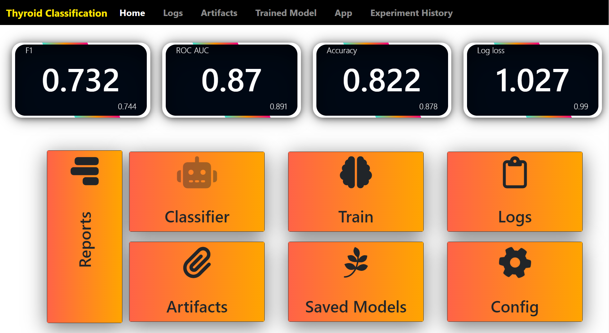

# <font color="red"><strong>Thyroid Disease Classification: A Multiclass Classification Approach</strong></font>


## **Background:**

Thyroid disease is a common cause of medical diagnosis and prediction, with an onset that is difficult to forecast in medical research. The thyroid gland is one of our body's most vital organs. Thyroid hormone releases are responsible for metabolic regulation. Hyperthyroidism and hypothyroidism are one of the two common diseases of the thyroid that releases thyroid hormones in regulating the rate of body's metabolism.


## **Problem Statement**
The main goal is to predict the estimated risk on a patient's chance of obtaining thyroid disease or not.

## **Dataset:**
<center>
<a href="https://archive.ics.uci.edu/ml/datasets/thyroid+disease"><button data-md-button>Dataset</button></a>
</center>


## **Deployment**

<center>
<a href="/"><button data-md-button>Deployment</button></a> 
</center>

## **Demo**
[DEMO](https://youtu.be/VFK3RyNAre8)


[](https://youtu.be/VFK3RyNAre8)


## **Tools & Techniques**

*   `Data versioning` using time stamp
*   `Code versioning` using Git
*   `Modular coding` with separate files for data ingestion, transformation, validation, training, evaluation, performance monitoring, model pusher, model configuration, constants, secret keys, artifacts etc
*   `CI / CD Pipeline` using GitHub Actions
*   `S3 Bucket` for storage of dataset.
*   `Docker` for creating container
*   Custome `logger`
*   Custom `Exception Handler`
*   `Package building` using setuptools
*   `Deplyment` tested on **Elastic Beanstalk**, **Auzre**, and on **AWS EC2 instance CI/CD** using Github Action Runner


## **Result**

*   Model trained on original data performed better than model trained on resampled data.
*   Best performer in both coditions is `RandomForestClassifier`
    *   Scores Achieved:
        

        | Metric                | Train | Test  |
        |-----------------------|-------|-------|
        | F1 weighted           | 0.744 | 0.732 |        
        | ROC AUC OVR Weighted  | 0.891 | 0.87 |
        | Balanced Accuracy     | 0.872 | 0.822 |
        | Log loss              | 0.99| 1.027 |
        


## **Evaluation Metrices**
*   F1 weighted score
*   ROC AUC (One vs Rest) Weighted
*   Balanced Accuracy
*   Log loss
*   ConfusionMetrics
*   Learning Curve
*   Complexity and Scalability


## **Approach**

*   Data collection, cleaning, missing value handling, outlier handling, Data Profiling, exploration.

*   Feature selection, reducing number of class labels from 14 to 7 by grouping the labels based on medical conditions.

*   Random Over Sampling of data but ommitted due to better performance of orgianl data on test dataset

*   Tested Machine Learning algorithms, including `RandomForestClassifier`, `KNeighborsClassifier`, `AdaBoost` and `GradientBoostingClassifir`.

*   Once the training is completd, model is passed through evaluation phase where it has to pass through set of logical conditons. Only the models above the threshold value of evaluation metrics are consider as accepted model and pushed for integration with FlaskApp

```
f1_logic = (train_f1 >= 0.738) and abs(train_f1 - test_f1) <= 0.009
roc_auc_logic = (roc_auc_ovr_weighted_train >= 0.89) and abs(roc_auc_ovr_weighted_train - roc_auc_ovr_weighted_test) <= 0.02
model_accuracy_logic = (train_balanced_accuracy_score >= base_accuracy) and diff_test_train_acc <= 0.04
loss_logic = (loss_train <= 1.013) and abs(loss_train - loss_test) <= 0.04


if f1_logic and roc_auc_logic and model_accuracy_logic and loss_logic:
        -------
        -------
        ------
```

*   Profiling Report, EDA Report and Evaluation Report generation

## **API and Web UI**

*   API exposed via `Flask-Web-App`
*   Dashboard displays score cards for `F1_weighted`, `ROC_AUC_OVR_Weighted`, `Balanced Accuracy`, `Log_loss`
*   Web dashboard allow you:
    *   View all reports for the deployed model:
        *   Profiling Report
        *   EDA Report
        *   Model Performance Report
    
    *   View, modify model configuration and save changes
    *   View and download models accepted above a threshold value of evaluation metrics
    *   Trigger model training
    *   View Logs
    *   View all the artifacts
    *   View history of model training


## **Deployments**

*   Azure
*   AWS EC2
*   Render


# **Installation**


## **Requirements**

*   Python 3.10.10
*   Scikit-learn
*   Seaborn
*   Matplotlib
*   Plotly
*   Pandas
*   Numpy
*   Imbalanced Learn
*   PyYAML
*   dill
*   six
*   Flask
*   gunicorn
*   natsort
*   Evidently
*   yData Profiling
*   boto3


## **Docker**

A Dockerfile is a text document that contains all the commands a user could call on the command line to assemble an image. Docker images can be used to create containers, which are isolated environments that run your application. This is useful because it ensures that your application runs in the same environment regardless of where it is being deployed.

To build and run this project using Docker, follow these steps:

1.  Install Docker on your machine if you haven't already.
2.  Open a terminal window and navigate to the project root directory.
3.  Build the Docker image by running the following command:

    ```
    docker build -t <image-name>:<version> <location-of-docker-file for curren directory just add dot (.)>

    ```
    or

    ```
    docker build -t <image-name>:<version> .
    
    ```

4.  To Check List of Docker Images
    ```
    docker images
    ```    

5.  Start a container using the following command, replacing <image-name> and <version> with the values you used in step 3:

    ```
    docker run -p <host-port>:<container-port> <image-name>:<version>

    ```

    or

    ```
    docker run -p 5000:5000 -e PORT=5000 <Image-ID>
    ```

6.  Open a web browser and go to `http://localhost:<host-port>` to see the application running.

7.  Check Running Containers in docker

    ```
    docker ps
    ```

8.  Stop Docker Container

    ```
    docker stop <container_id>
    ```    


# **Project Structure**


```
ML-04-ThyroidPrediction
├─ .dockerignore
├─ .git
|
├─ .github
│  └─ workflows
│     └─ main.yaml
├─ .gitignore
├─ .idea
|
├─ app.py
├─ config
│  ├─ config.yaml
│  ├─ model.yaml
│  └─ schema.yaml
|
├─ Dockerfile
├─ Docs
├─ LICENSE
├─ logs
├─ Notebook
├─ README.md
├─ requirements.txt
├─ saved_models
├─ setup.py
├─ static
├─ templates
│  ├─ bulk_prediction.html
│  ├─ drift_report.html
│  ├─ eda.html
│  ├─ experiment_history.html
│  ├─ files.html
│  ├─ header.html
│  ├─ index.html
│  ├─ log.html
│  ├─ log_files.html
│  ├─ PerformanceReport.html
│  ├─ predict.html
│  ├─ ProfileReport_1.html
│  ├─ ProfileReport_2.html
│  ├─ saved_models_files.html
│  ├─ train.html
│  └─ update_model.html
|
└─ ThyroidPrediction
   ├─ artifact
   │  ├─ base_data_ingestion
   │  │  
   │  ├─ data_validation
   |  |
   │  ├─ experiment
   │  │  └─ experiment.csv
   │  ├─ model_evaluation
   │  │  └─ model_evaluation.yaml
   │  ├─ model_trainer
   |  |
   │  ├─ Profiling
   |  |
   │  └─ transformed_data_dir
   | 
   ├─ component
   │  ├─ data_ingestion.py
   │  ├─ data_transformation.py
   │  ├─ data_validation.py
   │  ├─ model_evaluation.py
   │  ├─ model_performance.py
   │  ├─ model_pusher.py
   │  ├─ model_trainer.py
   │  └─ __init__.py
   ├─ config
   │  ├─ configuration.py
   │  └─ __init__.py
   ├─ constant
   │  └─ __init__.py
   ├─ dataset_base
   ├─ entity
   │  ├─ artifact_entity.py
   │  ├─ config_entity.py
   │  ├─ experiment.py
   │  ├─ model_factory.py
   │  ├─ thyroid_predictor.py
   │  └─ __init__.py
   ├─ exception
   │  └─ __init__.py
   ├─ logger
   │  └─ __init__.py
   ├─ pipeline
   │  ├─ pipeline.py
   │  └─ __init__.py
   ├─ secrets
   │  └─ __init__.py
   ├─ util
   │  ├─ util.py
   │  └─ __init__.py
   └─ __init__.py

```

